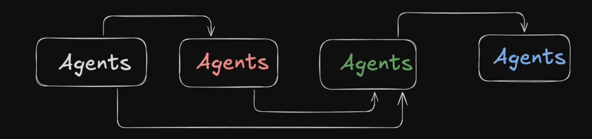
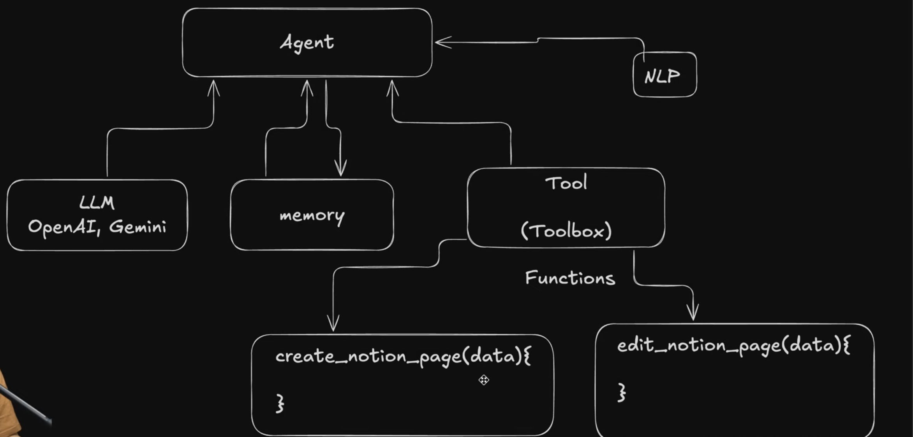
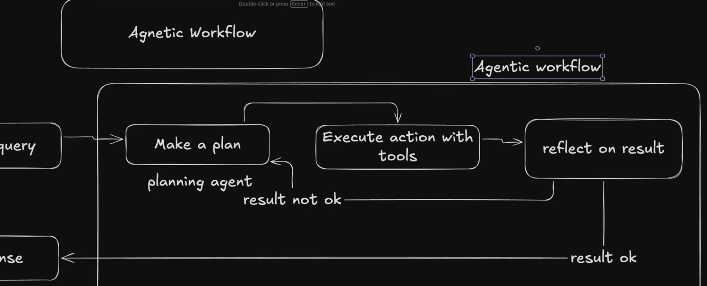
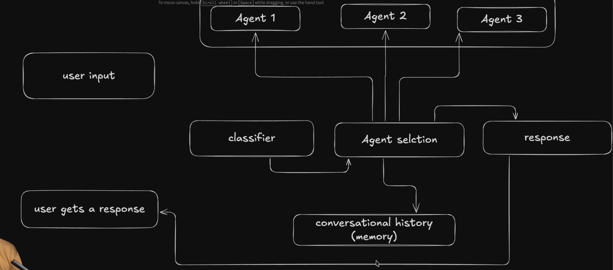

# Day 1 — 25 May 2026

# Microsoft Internship Learning Notes

Today was my first day as a Software Engineering Intern at Microsoft.  
The day mainly focused on understanding:


- AI Agents
- Agentic Workflows
- Multi-Agent Systems
- Microsoft Agent Framework
- MCP and A2A interoperability
- Basics of C#
- OOPS concepts
- Introduction to .NET Core


---

# AI Agents

## What are AI Agents?

AI agents are intelligent systems capable of:

- Understanding tasks
- Planning actions
- Using tools
- Taking actions autonomously
- Iterating based on feedback
- Producing final outcomes

Unlike traditional LLMs, AI agents can actually perform actions.

---

# Difference Between LLMs and AI Agents

## LLMs

LLMs mainly provide information and generate responses.

Example:

Asking:
> "What are the things to do in Hyderabad?"

The LLM provides:
- recommendations
- information
- suggestions

But usually does not perform actions.

Examples:
- GPT
- Claude
- Gemini

---

## AI Agents

AI agents can:
- understand goals
- plan tasks
- use tools
- execute actions
- improve responses through iteration
- Autonomous in nature

Example:

Instead of only suggesting events in Hyderabad, an AI agent can:
- book tickets
- add events to calendar
- reserve passes
- send reminders

This makes agents action-oriented systems instead of only information systems.

---

# Important Characteristics of AI Agents

## 1. Autonomy

Agents can work independently with minimal human intervention.

---

## 2. Planning

Agents can break complex tasks into smaller steps.

---

## 3. Iteration

Agents can retry tasks if the result quality is poor.

---

## 4. Feedback

Agents can evaluate outputs and improve future responses.

---

## 5. Human in the Loop

Humans can intervene during important decision-making stages.

This improves:
- safety
- accuracy
- reliability



---

# Agent Coordination

Sometimes multiple agents need to coordinate with each other.

Important considerations include:
- which agent should handle which task
- how information should be passed
- order of execution
- when to skip unnecessary iterations

Efficient coordination improves system performance.

---

# Orchestration Methods

Orchestration refers to how agents coordinate and communicate with each other.

---

## 1. Sequential Orchestration

Tasks are performed one after another in sequence.

Example:
- Agent 1 collects information
- Agent 2 analyzes it
- Agent 3 generates final response

---

## 2. Concurrent Orchestration

Multiple agents work simultaneously on different tasks.

This improves speed and parallelism.

---

## 3. Hierarchical Orchestration

A manager/supervisor agent controls other specialized agents.

The manager decides:
- task distribution
- priorities
- coordination

---

## 4. Handoff Orchestration

One agent transfers control or context to another specialized agent.

Example:
- booking agent hands off to payment agent

---

## 5. Group Chat Orchestration

Multiple agents collaborate like participants in a discussion.

Agents exchange:
- reasoning
- suggestions
- feedback

before generating final output.

---

# Components Required for AI Agents

AI agents require several important components.



---

## 1. LLM (Brain)

The LLM acts as the reasoning engine of the agent.

Examples:
- GPT
- Claude
- Gemini

The LLM helps in:
- understanding queries
- reasoning
- generating plans

---

## 2. Memory / Storage

Agents require memory to:
- maintain context
- remember conversations
- store information

Memory management is still an active research area because long-term contextual memory remains challenging.

---

## 3. Tooling / APIs

Agents use tools to perform actions.

Tools are essentially APIs or external functions.

Examples:
- booking tickets
- sending emails
- calendar scheduling
- database access

---

## 4. NLP (Natural Language Processing)

NLP helps agents:
- understand human language
- interpret intent
- process instructions

---

# Agentic Workflow



## What is Agentic Workflow?

Agentic workflow refers to the complete process followed by an AI agent to solve tasks.

---

# Steps in Agentic Workflow

## Step 1 — User Query

The user provides a request.

Example:
> "Book tickets for an event in Hyderabad."

---

## Step 2 — Planning

The agent analyzes the task and creates an execution plan.

---

## Step 3 — Action Execution

The agent uses tools/APIs to perform required actions.

---

## Step 4 — Reflection / Evaluation

The agent evaluates:
- response quality
- correctness
- missing information

If required, the agent can reiterate and improve the result.

---

## Step 5 — Final Response

The final validated output is provided to the user.

---

# Multi-Agent Workflow



## What is Multi-Agent Workflow?

In a multi-agent system, multiple agents collaborate to solve problems.

Different agents may specialize in:
- planning
- reasoning
- tool execution
- memory handling
- validation

Some systems may even use different LLM models for different tasks.

---

# Multi-Agent Workflow Process

## 1. User Input

The user provides the task.

---

## 2. Agent Selection

The system determines which agents should participate.

---

## 3. Classification

The task is categorized and routed appropriately.

---

## 4. Memory Handling

Conversational history and context are maintained.

---

## 5. Agent Collaboration

Multiple agents coordinate and exchange information.

---

## 6. Final Response

The system generates the final response after collaboration.

---

# Generative AI vs Agentic AI

## Generative AI

Generative AI mainly focuses on:
- content generation
- text generation
- answering questions
- creating images/code/content

It is mostly information-oriented.

---

## Agentic AI

Agentic AI focuses on:
- decision making
- execution
- taking actions
- tool usage
- automation

It is action-oriented instead of only information-oriented.

---

# Microsoft Agent Factory

## What is Microsoft Agent Factory?

Microsoft Agent Factory helps organizations transition from:
- AI experimentation
to
- production-scale AI execution

It supports enterprise-level deployment and governance.

---

# Features

- RBAC (Role Based Access Control)
- Training workflows
- Enterprise deployment
- Prepaid plans
- Scalable AI infrastructure
- Organizational AI adoption

---

# Microsoft Agent Framework

## What is Microsoft Agent Framework?

Microsoft Agent Framework is a unified framework for building production-ready AI agents.

It helps developers:
- create
- manage
- orchestrate
- deploy

AI agent systems efficiently.

---

# Interoperability in Microsoft Agent Framework

The framework supports interoperability between different agent systems.

---

# A2A (Agent-to-Agent)

A2A enables communication between multiple AI agents.

This allows:
- collaboration
- task delegation
- distributed problem solving

between agents.

---

# MCP (Model Context Protocol)

MCP is a standardized protocol that helps AI systems communicate with:
- tools
- APIs
- external systems
- data sources

in a structured and reusable manner.

MCP improves:
- interoperability
- tool integration
- extensibility of AI systems

---

# Key Takeaways

- AI agents are action-oriented systems.
- LLMs mainly generate information.
- Agents use planning, memory, tools, and feedback loops.
- Multi-agent systems improve scalability and specialization.
- Agent orchestration is important for coordination.
- Microsoft provides frameworks for enterprise-grade AI agent development.

---

# Topics to Explore Further

- Long-term memory in AI agents
- Tool calling architectures
- Agent security and governance
- Multi-agent optimization
- AI orchestration frameworks
- Production-ready agent deployment


---

# C# Basics

## What is C#?

C# is an object-oriented programming language developed by Microsoft.  
It is widely used for:

- Backend development
- Web applications
- Cloud services
- APIs
- Enterprise applications
- Desktop applications

C# works closely with the .NET ecosystem.

---

# Concepts Learned in C#

## Functions / Methods

Functions are reusable blocks of code used to perform specific tasks.

Example:

```csharp
using System;

class Program
{
    static void Greet()
    {
        Console.WriteLine("Hello");
    }

    static void Main()
    {
        Greet();
    }
}
```

---

# OOPS Concepts

OOPS stands for Object Oriented Programming System.

The main concepts are:

## 1. Encapsulation

Binding data and methods together into a single unit (class).

---

## 2. Abstraction

Showing only necessary details while hiding implementation complexity.

---

## 3. Inheritance

One class acquiring properties and methods from another class.

---

## 4. Polymorphism

Same method behaving differently in different situations.

---

# Introduction to .NET Core

## What is .NET Core?

.NET Core is Microsoft's cross-platform development framework used to build:

- Web applications
- APIs
- Cloud applications
- Microservices
- Backend systems

It supports:
- Windows
- Linux
- macOS

---

# Important Features of .NET Core

- Cross-platform
- High performance
- Open source
- Scalable
- Cloud friendly


--- 

# C# and .NET for MERN Stack Developers

# Introduction

As a MERN stack developer, transitioning into C# and .NET becomes much easier when concepts are mapped with technologies already familiar in JavaScript and Node.js ecosystems.

This document explains:
- C#
- .NET
- ASP.NET Core
- Backend architecture
- Dependency Injection
- Middleware
- APIs
- Entity Framework
- Async programming

using MERN stack analogies.

---

# Understanding the Ecosystem

# MERN Stack

MERN consists of:

- MongoDB → Database
- Express.js → Backend framework
- React → Frontend
- Node.js → Runtime

---

# .NET Ecosystem

.NET ecosystem mainly consists of:

- C# → Programming Language
- .NET Runtime → Execution environment
- ASP.NET Core → Backend framework
- Entity Framework Core → ORM
- SQL Server / PostgreSQL → Databases

---

# High-Level Mapping

| MERN | .NET Equivalent |
|---|---|
| JavaScript | C# |
| Node.js | .NET Runtime |
| Express.js | ASP.NET Core |
| Mongoose | Entity Framework Core |
| npm | NuGet |
| package.json | .csproj |
| async/await | async/await |
| Middleware | Middleware |
| REST APIs | Controllers / Minimal APIs |
| MongoDB | SQL Server/PostgreSQL |

---

# What is C#?

C# is an object-oriented programming language developed by Microsoft.

It is:
- strongly typed
- compiled
- object-oriented
- high performance

Unlike JavaScript, C# performs type checking during compilation.

---

# JavaScript vs C#

## JavaScript

```javascript
let age = 21;
age = "hello";
```

JavaScript allows dynamic typing.

---

## C#

```csharp
int age = 21;
age = "hello"; // Error
```

C# enforces type safety.

This improves:
- reliability
- scalability
- maintainability

especially in enterprise systems.

---

# Structure of a C# Program

```csharp
using System;

class Program
{
    static void Main()
    {
        Console.WriteLine("Hello World");
    }
}
```

---

# Explanation

| Component | Purpose |
|---|---|
| using | Imports namespaces |
| class | Blueprint for objects |
| Main() | Entry point |
| Console.WriteLine | Prints output |

---

# Variables and Data Types

```csharp
int age = 21;
string name = "Siddhan";
bool isIntern = true;
double salary = 50000.50;
```

---

# MERN Comparison

| JavaScript | C# |
|---|---|
| let | typed variable |
| string | string |
| number | int/double |
| boolean | bool |

---

# Functions in C#

```csharp
static int Add(int a, int b)
{
    return a + b;
}
```

---

# JavaScript Equivalent

```javascript
function add(a, b) {
    return a + b;
}
```

---

# Object-Oriented Programming (OOPS)

C# heavily relies on OOPS.

Core principles:

- Encapsulation
- Inheritance
- Polymorphism
- Abstraction

---

# Classes and Objects

```csharp
class Car
{
    public string brand;

    public void Drive()
    {
        Console.WriteLine("Driving...");
    }
}
```

Creating object:

```csharp
Car c = new Car();
c.brand = "BMW";
c.Drive();
```

---

# MERN Analogy

Equivalent to JavaScript objects/classes:

```javascript
class Car {
    constructor() {
        this.brand = "";
    }

    drive() {
        console.log("Driving...");
    }
}
```

---

# Access Modifiers

| Modifier | Meaning |
|---|---|
| public | Accessible everywhere |
| private | Accessible only inside class |
| protected | Accessible in inheritance |
| internal | Accessible inside assembly |

---

# What is .NET?

.NET is the development platform/runtime where C# applications execute.

It provides:
- runtime
- libraries
- memory management
- garbage collection
- networking
- security

---

# Understanding Runtime

In MERN:
- Node.js executes JavaScript.

In .NET:
- CLR (Common Language Runtime) executes C# applications.

---

# Compilation Flow

## JavaScript

```txt
JavaScript → Node.js Runtime
```

---

## C#

```txt
C# Code
   ↓
Intermediate Language (IL)
   ↓
CLR Execution
```

---

# ASP.NET Core

ASP.NET Core is Microsoft's backend framework.

Equivalent of:
- Express.js in MERN.

Used for:
- APIs
- backend services
- microservices
- enterprise systems

---

# Creating API in ASP.NET Core

```bash
dotnet new webapi
```

Run:

```bash
dotnet run
```

---

# Express.js vs ASP.NET Core

## Express.js

```javascript
app.get("/users", (req, res) => {
    res.send("Users");
});
```

---

## ASP.NET Core

```csharp
[ApiController]
[Route("api/users")]
public class UsersController : ControllerBase
{
    [HttpGet]
    public string Get()
    {
        return "Users";
    }
}
```

---

# Controllers

Controllers handle HTTP requests.

Equivalent to:
- Express route handlers.

---

# Routing

## Express

```javascript
app.get("/products")
```

---

## ASP.NET Core

```csharp
[HttpGet("products")]
```

---

# Middleware

Middleware processes requests before response generation.

Examples:
- authentication
- logging
- CORS
- error handling

---

# Express Middleware

```javascript
app.use(express.json());
```

---

# ASP.NET Core Middleware

```csharp
app.UseAuthorization();
app.UseAuthentication();
```

---

# Dependency Injection (VERY IMPORTANT)

Dependency Injection (DI) is a core concept in .NET.

Instead of manually creating objects, dependencies are automatically injected.

---

# Without DI

```csharp
UserService service = new UserService();
```

---

# With DI

```csharp
public class UserController
{
    private readonly UserService _service;

    public UserController(UserService service)
    {
        _service = service;
    }
}
```

---

# Why DI Matters

Benefits:
- loose coupling
- testability
- scalability
- maintainability

This is heavily used in enterprise systems.

---

# Services in ASP.NET Core

Services contain business logic.

Equivalent to:
- service layer in MERN backend.

---

# Project Structure

Typical ASP.NET Core structure:

```txt
Controllers/
Services/
Models/
Repositories/
Middleware/
DTOs/
Program.cs
```

---

# Entity Framework Core (ORM)

Entity Framework Core is ORM for .NET.

Equivalent to:
- Mongoose/Prisma/Sequelize.

It maps:
- database tables
to
- C# objects.

---

# Example Entity

```csharp
public class User
{
    public int Id { get; set; }
    public string Name { get; set; }
}
```

---

# DbContext

Equivalent to database connection manager.

```csharp
public class AppDbContext : DbContext
{
    public DbSet<User> Users { get; set; }
}
```

---

# CRUD Operations

## Create

```csharp
_context.Users.Add(user);
await _context.SaveChangesAsync();
```

---

## Read

```csharp
var users = await _context.Users.ToListAsync();
```

---

## Update

```csharp
_context.Users.Update(user);
await _context.SaveChangesAsync();
```

---

## Delete

```csharp
_context.Users.Remove(user);
await _context.SaveChangesAsync();
```

---

# Async Programming

C# strongly supports asynchronous programming.

Very similar to Node.js async/await.

---

# Example

```csharp
public async Task<string> GetData()
{
    await Task.Delay(1000);
    return "Done";
}
```

---

# JavaScript Equivalent

```javascript
async function getData() {
    await delay(1000);
    return "Done";
}
```

---

# Authentication

ASP.NET Core supports:
- JWT authentication
- OAuth
- Identity
- Role-based authorization

Very similar to MERN auth flows.

---

# JWT Authentication

Common flow:
1. User login
2. Generate JWT
3. Send token
4. Validate token in middleware

---

# Configuration System

Equivalent to `.env`.

## appsettings.json

```json
{
  "ConnectionStrings": {
    "DefaultConnection": "..."
  }
}
```

---

# NuGet Packages

Equivalent to npm packages.

Install package:

```bash
dotnet add package PackageName
```

---

# Build and Run

## Build

```bash
dotnet build
```

---

## Run

```bash
dotnet run
```

---

# Hot Reload

```bash
dotnet watch run
```

Equivalent to:
- nodemon

---

# Garbage Collection

Unlike C/C++, memory management is automatic.

CLR manages:
- memory allocation
- cleanup
- garbage collection

This reduces memory leaks.

---

# LINQ (VERY IMPORTANT)

LINQ = Language Integrated Query

Used for querying collections.

Equivalent to JavaScript array methods.

---

# JavaScript

```javascript
users.filter(u => u.age > 18);
```

---

# LINQ

```csharp
users.Where(u => u.Age > 18);
```

---

# Error Handling

```csharp
try
{
    int x = 10 / 0;
}
catch(Exception ex)
{
    Console.WriteLine(ex.Message);
}
```

---

# Interfaces

Interfaces define contracts.

Very important in scalable backend systems.

```csharp
public interface IUserService
{
    Task GetUsers();
}
```

---

# Logging

ASP.NET Core has built-in logging support.

Used for:
- monitoring
- debugging
- observability

---

# Common Enterprise Features in .NET

- Dependency Injection
- Middleware Pipeline
- Strong Typing
- Scalability
- Authentication
- Logging
- High Performance APIs
- Cloud Integration
- Microservices

---

# Why Enterprises Prefer .NET

- Performance
- Security
- Maintainability
- Strong tooling
- Azure integration
- Scalability
- Large ecosystem

---

# MERN vs .NET Philosophy

## MERN

- fast development
- flexible
- dynamic
- startup friendly

---

## .NET

- structured
- enterprise-focused
- scalable
- strongly typed
- maintainable

---

# Important Concepts to Learn Next

## C#

- Generics
- Delegates
- Events
- LINQ
- Async/Await
- Collections
- Exception Handling

---

# ASP.NET Core

- Middleware pipeline
- Dependency Injection
- Authentication
- Authorization
- Web APIs
- Minimal APIs
- Entity Framework Core

---

# Cloud Topics

- Azure
- Docker
- Kubernetes
- CI/CD
- Microservices

---

# Key Takeaways

- C# is strongly typed unlike JavaScript.
- ASP.NET Core is similar to Express.js.
- Entity Framework is similar to Mongoose.
- Dependency Injection is central in .NET.
- .NET is highly enterprise-oriented.
- Async programming is very similar to Node.js.
- .NET emphasizes scalability and maintainability.

---

# Final Understanding

As a MERN developer:
- backend concepts already transfer well
- APIs work similarly
- middleware concepts remain similar
- async programming remains familiar

The biggest shifts are:
- strong typing
- OOPS-heavy architecture
- Dependency Injection
- enterprise-grade structure
- stricter design patterns

Once these are understood, transitioning from MERN to .NET becomes significantly easier.